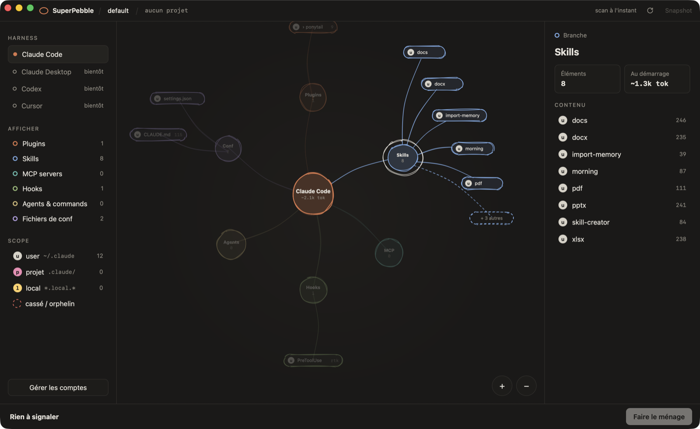

<h1 align="center">SuperPebble</h1>

<p align="center">
  Tout ce qui est branché sur Claude Code, sur une carte dessinée à la main —<br>
  plugins, skills, serveurs MCP, hooks, agents, CLAUDE.md — et ce qui est cassé.
</p>

<p align="center"><sub>Rust + Tauri · macOS, Linux, Windows · MIT</sub></p>

<p align="center">
  <a href="#fonctionnalités">Fonctionnalités</a> ·
  <a href="#installer">Installer</a> ·
  <a href="#en-ligne-de-commande">Ligne de commande</a> ·
  <a href="#plusieurs-comptes">Comptes</a> ·
  <a href="#développement">Développement</a> ·
  <a href="CHANGELOG.md">Changelog</a> ·
  <a href="README.md">English</a>
</p>

<p align="center">
  
</p>

Votre config Claude Code est éparpillée entre `~/.claude`, `~/.claude.json`,
le `.claude/` de chaque projet, `.mcp.json`, le cache des plugins et les
réglages managés. SuperPebble lit tout ça et dessine ce que Claude Code charge
vraiment : un galet par élément, une branche par type, un badge par scope.

## Fonctionnalités

- **Toute la config sur une carte** : les plugins et ce qu'ils apportent, les
  skills, serveurs MCP, hooks, agents, commandes slash, `CLAUDE.md` et fichiers
  de réglages.
- **Les scopes d'un coup d'œil** : user, projet, local et managed, chacun avec
  son badge, pour savoir d'où vient vraiment un skill ou un serveur.
- **Diagnostic** : signale les serveurs MCP orphelins (commande introuvable),
  les hooks cassés (script manquant), les secrets en clair, les doublons entre
  scopes, les skills invalides et le JSON illisible.
- **Poids en tokens** : une estimation (caractères/4) de ce que coûte chaque
  fichier au démarrage, et `superpebble weight` pour le total par catégorie,
  avec les fichiers les plus lourds.
- **En direct** : un file watcher relance le scan dès qu'un fichier de config
  change.
- **Plusieurs comptes Claude Code** : créez des comptes `~/.claude-<nom>`,
  partagez skills, agents, commandes ou `CLAUDE.md` avec le compte par défaut
  par des liens symboliques, et obtenez un alias `claude-<nom>` dans `~/.zshrc`.
- **Lecture seule par défaut** : le scan n'exécute jamais un serveur MCP ni un
  hook, et la valeur des secrets ne sort jamais du scanner. La gestion des
  comptes ne touche qu'à `~/.claude-<nom>`, et `~/.zshrc` est sauvegardé avant
  toute modification.

## Installer

Téléchargez l'installeur de votre système dans la [dernière release](https://github.com/te-o-o-o/SuperPebble/releases/latest) :
setup `.exe` ou `.zip` portable sous Windows, `.dmg` universel sous macOS,
`.AppImage` ou `.deb` sous Linux. Rien n'est signé : Windows affiche un
avertissement SmartScreen, et macOS demande une fois
`xattr -dr com.apple.quarantine SuperPebble.app`.

Ou compilez depuis les sources. Il faut Rust et Node :

```sh
npm install
npx tauri build --bundles app       # macOS : target/release/bundle/macos/SuperPebble.app
npx tauri build --bundles deb       # Linux, ou appimage
```

Puis ouvrez l'app, ou lancez-la depuis un terminal pour voir ses logs :

```sh
open target/release/bundle/macos/SuperPebble.app
./target/release/bundle/macos/SuperPebble.app/Contents/MacOS/superpebble-app
```

## En ligne de commande

Le scanner est aussi un CLI autonome, sans fenêtre. Installez-le avec
`cargo install --path crates/superpebble`, ou lancez-le sur place :

```sh
cargo run -p superpebble -- doctor      # les problèmes du projet courant
cargo run -p superpebble -- weight      # contexte estimé au démarrage, par catégorie
cargo run -p superpebble -- scan        # le graphe en JSON
cargo run -p superpebble -- accounts    # comptes, partages et alias shell
```

`--config DIR` choisit le compte (par défaut `$CLAUDE_CONFIG_DIR` ou
`~/.claude`), `--project DIR` ou `--no-project` le projet (par défaut : le
dossier courant). `doctor` sort avec 0 (rien), 1 (avertissements) ou 2
(erreurs) et accepte `--json`, `--severity warn|error` et `--quiet`, pour la CI.
Toutes les options et règles : [crates/superpebble/README.md](crates/superpebble/README.md).

## Plusieurs comptes

Un compte est un dossier de config : `~/.claude` est celui par défaut,
`~/.claude-pro` est le compte `pro`. Depuis **Gérer les comptes**, SuperPebble
crée le dossier, lie ce que vous voulez partager avec le compte par défaut, et
ajoute l'alias :

```sh
claude-pro     # = CLAUDE_CONFIG_DIR=$HOME/.claude-pro claude
```

Les serveurs MCP, les plugins et les identifiants restent toujours propres à
chaque compte.

## Développement

```sh
# Linux / WSL : dépendances système de Tauri, une fois
sudo apt install libwebkit2gtk-4.1-dev build-essential libxdo-dev libssl-dev libayatana-appindicator3-dev librsvg2-dev

npm run tauri dev               # l'app, avec rechargement à chaud
cargo test -p superpebble
```

Sans Tauri, `npm run fixture && npm run dev` affiche le graphe du dossier
courant dans un navigateur.

```
crates/superpebble/   scan, règles et comptes, sans Tauri (lib + CLI `superpebble`)
src-tauri/            coque Tauri : commandes IPC, file watcher
src/                  UI React : React Flow + rough.js
```

Build Windows, depuis Linux ou WSL :

```sh
npx tauri build --target x86_64-pc-windows-gnu --no-bundle
```

Livrez `superpebble-app.exe` avec `WebView2Loader.dll`, depuis
`target/x86_64-pc-windows-gnu/release/`.

## Release

La version est à un seul endroit, `[workspace.package]` dans le `Cargo.toml`
racine : l'app et le crate en héritent. Montez-la, datez la section
`Unreleased` du [CHANGELOG.md](CHANGELOG.md), commitez, puis taguez :

```sh
git tag v0.2.0 && git push --tags
cargo publish -p superpebble        # le CLI sur crates.io, à la main
```

Le workflow `release` construit l'installeur Windows et le zip portable,
l'image disque macOS universelle, l'AppImage et le `.deb` Linux, puis les
publie dans une GitHub Release. Les binaires ne sont pas signés.

## Licence

MIT, voir [LICENSE](LICENSE).
